<p align="center">
  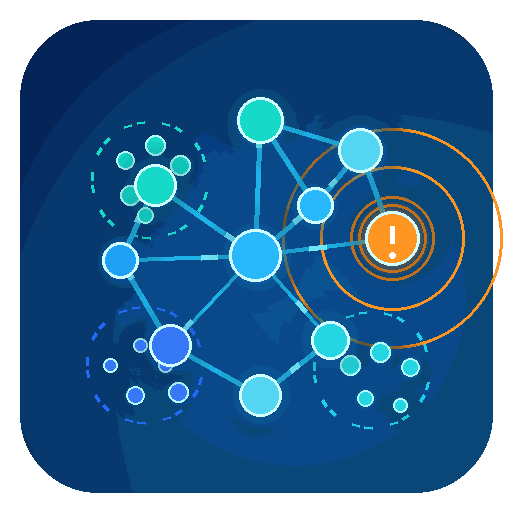
</p>

# SOCIAL ANOMALY CLUSTERING - DATA MINING FINAL PROJECT

<p align="center">
  
  
  
  
  
  
  
</p>

<div align="center">
  <b><a href="./README_VI.md">Vietnamese Version</a></b>
</div>

## Student Information

<p align="center">
  <a href="https://huit.edu.vn/">
    
  </a>
</p>

| Student ID | Full name | GitHub | Email |
|:----------:|------------------|-----------------------------------------|------------------------|
| 2001230791 | Doan Tan Minh Tan | [TanDoan1234](https://github.com/TanDoan1234) | doanminhtan.dev@gmail.com |

---

## Table of Contents
- [1. Project Overview](#1-project-overview)
- [2. Problem Statement](#2-problem-statement)
- [3. Dataset Description](#3-dataset-description)
- [4. Project Structure](#4-project-structure)
- [5. Data Processing Pipeline](#5-data-processing-pipeline)
- [6. Notebook Workflow](#6-notebook-workflow)
- [7. Data Cleaning and Preprocessing](#7-data-cleaning-and-preprocessing)
- [8. Feature Engineering](#8-feature-engineering)
- [9. Feature Scaling](#9-feature-scaling)
- [10. Clustering Algorithms](#10-clustering-algorithms)
- [11. Experimental Results](#11-experimental-results)
- [12. Key Visualizations](#12-key-visualizations)
- [13. Limitations](#13-limitations)
- [14. How to Run](#14-how-to-run)
- [15. Conclusion](#15-conclusion)

---

## 1. Project Overview

**Social Anomaly Clustering** is a data mining project that applies unsupervised machine learning techniques to detect anomalous user behavior on social media platforms, specifically Twitter/X.

The project does not aim to build a supervised bot classifier. Instead, it focuses on discovering hidden behavior patterns from user metadata and interaction-related features. Users that strongly deviate from major behavioral groups are treated as potential anomaly users.

The project compares two clustering-based approaches:

- **K-Means Clustering**
- **DBSCAN Clustering**

The available `bot_label` column is not used during clustering. It is used only after clustering to evaluate whether the detected anomaly groups contain a higher ratio of bot accounts.

---

## 2. Problem Statement

Social media platforms often contain different types of abnormal users, including spam accounts, bot-like accounts, and users with unusual interaction patterns. These accounts may behave differently from the majority of normal users.

However, in many real-world scenarios, reliable labels may be unavailable or expensive to obtain. Therefore, unsupervised learning methods can be useful for discovering suspicious behavior without directly relying on labeled data.

This project addresses the following question:

> Can clustering algorithms identify groups of users whose behavior deviates from the majority of social media users?

The main idea is:

```text
Normal users tend to form dense or stable behavioral groups.
Anomalous users tend to appear far from main clusters or in low-density regions.
```

---

## 3. Dataset Description

The project uses the **Twitter Bot Detection Dataset** from Kaggle.

* **Dataset source:** [Twitter Bot Detection Dataset - Kaggle](https://www.kaggle.com/datasets/goyaladi/twitter-bot-detection-dataset?select=bot_detection_data.csv)
* **Input file:** `bot_detection_data.csv`
* **Number of records:** 50,000
* **Number of original columns:** 11

The raw dataset is placed at:

```text
datasets/raw/bot_detection_data.csv
```

### 3.1 Raw Input Columns

| Original Column  | Renamed Column   | Description                          | Used for Clustering               |
| ---------------- | ---------------- | ------------------------------------ | --------------------------------- |
| `User ID`        | `user_id`        | Unique identifier of the user        | No                                |
| `Username`       | `username`       | Twitter/X username                   | Used to create `username_length`  |
| `Tweet`          | `tweet`          | Tweet text content                   | Used to create `tweet_length`     |
| `Retweet Count`  | `retweet_count`  | Number of retweets                   | Yes                               |
| `Mention Count`  | `mention_count`  | Number of mentions                   | Yes                               |
| `Follower Count` | `follower_count` | Number of followers                  | Yes                               |
| `Verified`       | `verified`       | Account verification status          | Yes, converted to 0/1             |
| `Bot Label`      | `bot_label`      | Human/Bot label                      | No, evaluation only               |
| `Location`       | `location`       | User-declared location               | Not used in final features        |
| `Created At`     | `created_at`     | Account or record creation timestamp | Used to create `account_age_days` |
| `Hashtags`       | `hashtags`       | Hashtags in tweet                    | Used to create hashtag features   |

### 3.2 Label Usage

The dataset contains a `bot_label` column. However, this column is not used as a training feature because the project follows an unsupervised data mining approach.

The role of `bot_label` is:

```text
Used during clustering: No
Used during evaluation: Yes
```

This ensures that the clustering process is based only on user behavior features.

---

## 4. Project Structure

```text
social-anomaly-clustering/
│
├── README.md
├── README_VI.md
├── requirements.txt
├── main.py
│
├── configs/
│   └── config.yaml
│
├── assets/
│   ├── social_anomaly_clustering_animated_logo.gif
│   └── Logo HUIT-03.png
│
├── datasets/
│   ├── raw/
│   │   └── bot_detection_data.csv
│   │
│   ├── cleaned/
│   │   └── bot_detection_clean.csv
│   │
│   └── processed/
│       ├── user_features.csv
│       ├── user_features_scaled.csv
│       └── user_features_with_label.csv
│
├── notebooks/
│   ├── 01_explore_dataset.ipynb
│   ├── 02_preprocessing_feature_engineering.ipynb
│   ├── 03_kmeans_clustering.ipynb
│   ├── 04_dbscan_clustering.ipynb
│   └── 05_evaluation_visualization.ipynb
│
├── src/
│   ├── __init__.py
│   ├── data_loader.py
│   ├── preprocessing.py
│   ├── feature_engineering.py
│   ├── clustering.py
│   ├── evaluation.py
│   └── visualization.py
│
└── results/
    ├── models/
    │   ├── scaler.pkl
    │   ├── kmeans_model.pkl
    │   ├── dbscan_model.pkl
    │   └── pca_model.pkl
    │
    ├── csv/
    │   ├── kmeans_clustered_users.csv
    │   ├── kmeans_anomaly_users.csv
    │   ├── dbscan_clustered_users.csv
    │   ├── dbscan_anomaly_users.csv
    │   ├── cluster_summary.csv
    │   ├── dbscan_cluster_summary.csv
    │   ├── evaluation_summary.csv
    │   └── algorithm_comparison.csv
    │
    ├── figures/
    │   ├── label_distribution.png
    │   ├── correlation_matrix.png
    │   ├── elbow_method.png
    │   ├── silhouette_score.png
    │   ├── pca_kmeans.png
    │   ├── pca_kmeans_anomaly.png
    │   ├── pca_dbscan.png
    │   ├── pca_dbscan_anomaly.png
    │   ├── compare_anomaly_users.png
    │   ├── compare_bot_ratio_normal_vs_anomaly.png
    │   └── compare_silhouette_score.png
    │
    └── logs/
        └── experiment.log
```

---

## 5. Data Processing Pipeline

The complete workflow is shown below.

<p align="center">
  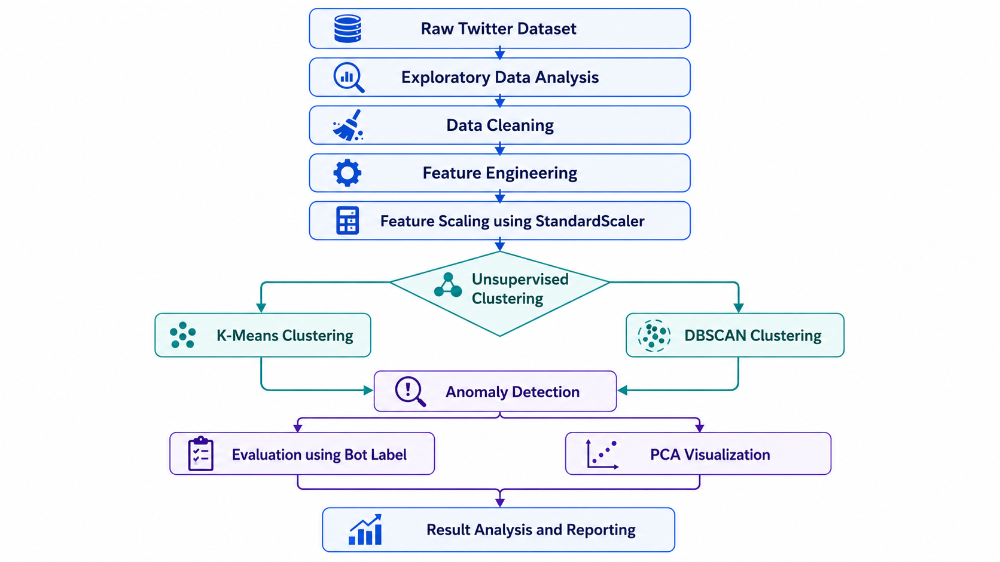
</p>

### Important Note about PCA

PCA is used only for visualization.
The clustering models are trained on the full scaled feature set, not on the 2D PCA output.

---

## 6. Notebook Workflow

| Notebook                                     | Main Purpose                                                                 | Main Output                                              |
| -------------------------------------------- | ---------------------------------------------------------------------------- | -------------------------------------------------------- |
| `01_explore_dataset.ipynb`                   | Explore dataset structure, missing values, distributions, label balance      | EDA figures and initial observations                     |
| `02_preprocessing_feature_engineering.ipynb` | Clean data, rename columns, handle missing values, create numerical features | `user_features.csv`, `user_features_scaled.csv`          |
| `03_kmeans_clustering.ipynb`                 | Apply K-Means, select K, calculate anomaly score                             | `kmeans_clustered_users.csv`, `kmeans_anomaly_users.csv` |
| `04_dbscan_clustering.ipynb`                 | Apply DBSCAN, tune `eps` and `min_samples`, detect noise                     | `dbscan_clustered_users.csv`, `dbscan_anomaly_users.csv` |
| `05_evaluation_visualization.ipynb`          | Compare K-Means and DBSCAN results                                           | `evaluation_summary.csv`, comparison figures             |

---

## 7. Data Cleaning and Preprocessing

### 7.1 Column Renaming

Raw column names contain spaces and uppercase letters. They were converted into `snake_case` format.

Example:

```text
User ID        -> user_id
Retweet Count -> retweet_count
Mention Count -> mention_count
Follower Count -> follower_count
Bot Label     -> bot_label
Created At    -> created_at
```

### 7.2 Missing Value Handling

The `hashtags` column contains missing values. These missing values were replaced with an empty string:

```python
df_clean["hashtags"] = df_clean["hashtags"].fillna("")
```

This is reasonable because a missing hashtag field can be interpreted as a tweet without hashtags.

### 7.3 Data Type Conversion

The following conversions were performed:

| Column       | Before        | After       |
| ------------ | ------------- | ----------- |
| `verified`   | Boolean       | Integer 0/1 |
| `created_at` | String/Object | Datetime    |

The `created_at` column was converted to datetime so that account age could be calculated.

---

## 8. Feature Engineering

The original dataset contains text, categorical, numerical, and time-based fields. Since K-Means and DBSCAN require numerical inputs, several numerical features were created.

### 8.1 Final Features Used for Clustering

| Feature            | Description                                                        |
| ------------------ | ------------------------------------------------------------------ |
| `retweet_count`    | Number of retweets                                                 |
| `mention_count`    | Number of mentions                                                 |
| `follower_count`   | Number of followers                                                |
| `verified`         | Verified status converted into 0/1                                 |
| `tweet_length`     | Number of characters in the tweet                                  |
| `username_length`  | Number of characters in the username                               |
| `hashtag_count`    | Number of hashtags used                                            |
| `has_hashtag`      | Binary feature indicating whether hashtags exist                   |
| `account_age_days` | Number of days from `created_at` to the latest date in the dataset |

### 8.2 Excluded Columns

| Column       | Reason for Exclusion                             |
| ------------ | ------------------------------------------------ |
| `user_id`    | Identifier only, not behavioral information      |
| `username`   | Text field, converted into `username_length`     |
| `tweet`      | Text field, converted into `tweet_length`        |
| `location`   | Not used in final feature set                    |
| `created_at` | Converted into `account_age_days`                |
| `hashtags`   | Converted into `hashtag_count` and `has_hashtag` |
| `bot_label`  | Used only for evaluation, not clustering         |

---

## 9. Feature Scaling

Because the selected features have different value ranges, feature scaling is required before applying clustering.

For example:

```text
follower_count      ranges from 0 to 10000
mention_count       ranges from 0 to 5
verified            ranges from 0 to 1
account_age_days    is measured in days
```

If scaling is not applied, features with larger values such as `follower_count` and `account_age_days` may dominate distance-based clustering.

This project uses:

```text
StandardScaler
```

StandardScaler transforms each feature to have approximately:

```text
mean = 0
standard deviation = 1
```

The scaled dataset is saved as:

```text
datasets/processed/user_features_scaled.csv
```

The fitted scaler is saved as:

```text
results/models/scaler.pkl
```

---

## 10. Clustering Algorithms

## 10.1 K-Means Clustering

K-Means is a centroid-based clustering algorithm. It groups data points by minimizing the distance between each point and the nearest cluster center.

### K Selection

The project evaluated different values of `K` using:

* Elbow Method
* Silhouette Score

The Silhouette Score was highest at `K = 2`. However, `K = 3` was selected for the final experiment because it provides more interpretable behavioral groups for anomaly analysis.

### K-Means Anomaly Detection

K-Means does not directly output anomaly points. Therefore, anomaly detection was performed using distance to the nearest centroid:

```text
anomaly_score = distance from user to nearest cluster centroid
```

The top 5% of users with the highest anomaly scores were marked as anomaly users.

Final K-Means setting:

```text
n_clusters = 3
anomaly threshold = top 5% highest anomaly_score
```

---

## 10.2 DBSCAN Clustering

DBSCAN is a density-based clustering algorithm. It groups points that are close to each other in dense regions and marks isolated points as noise.

Unlike K-Means, DBSCAN does not require the number of clusters in advance.

### DBSCAN Parameters

The main parameters are:

| Parameter     | Meaning                                                         |
| ------------- | --------------------------------------------------------------- |
| `eps`         | Maximum distance between neighboring points                     |
| `min_samples` | Minimum number of nearby points required to form a dense region |

After testing multiple parameter combinations, the selected configuration was:

```text
eps = 1.1
min_samples = 15
```

This configuration produced a reasonable anomaly ratio and stable cluster structure.

### DBSCAN Anomaly Detection

In DBSCAN, points assigned to cluster `-1` are treated as noise.

```text
cluster = -1 -> anomaly user
```

---

## 11. Experimental Results

### 11.1 Overall Comparison

| Algorithm   | Number of Clusters | Anomaly Users | Anomaly Ratio | Silhouette Score |
| ----------- | -----------------: | ------------: | ------------: | ---------------: |
| **K-Means** |                  3 |         2,500 |         5.00% |            0.151 |
| **DBSCAN**  |                  4 |         2,816 |         5.63% |            0.123 |

### Interpretation

K-Means detected exactly 2,500 anomaly users because the threshold was manually set to the top 5% anomaly score.

DBSCAN detected 2,816 anomaly users automatically as noise points, corresponding to 5.63% of the dataset.

K-Means achieved a higher Silhouette Score than DBSCAN, suggesting that K-Means produced slightly better-separated clusters in this experiment.

---

## 11.2 Bot Ratio Evaluation

| Algorithm   | Normal Bot Ratio | Anomaly Bot Ratio | Difference |
| ----------- | ---------------: | ----------------: | ---------: |
| **K-Means** |           49.95% |            51.64% |     +1.69% |
| **DBSCAN**  |           50.02% |            50.28% |     +0.26% |

### Interpretation

The anomaly group detected by K-Means had a higher bot ratio than the normal group by 1.69%.

The anomaly group detected by DBSCAN also had a slightly higher bot ratio than the normal group, but the difference was only 0.26%.

This suggests that K-Means captured anomaly users that were slightly more related to bot-like behavior in this feature space. However, the difference is still relatively small, meaning that the current features are not strong enough to clearly separate bot and human accounts.

---

## 11.3 Feature Comparison Between Normal and Anomaly Groups

| Algorithm | Group   | Retweet Count | Mention Count | Follower Count | Tweet Length | Username Length | Hashtag Count |
| --------- | ------- | ------------: | ------------: | -------------: | -----------: | --------------: | ------------: |
| K-Means   | Normal  |         49.94 |          2.51 |        4990.60 |        62.43 |            9.69 |          2.50 |
| K-Means   | Anomaly |         51.20 |          2.53 |        4950.64 |        66.30 |           11.92 |          2.45 |
| DBSCAN    | Normal  |         49.96 |          2.51 |        4992.97 |        62.23 |            9.60 |          2.54 |
| DBSCAN    | Anomaly |         50.76 |          2.53 |        4915.41 |        69.21 |           13.14 |          1.84 |

### Interpretation

For K-Means, anomaly users tend to have longer tweets and longer usernames compared to normal users.

For DBSCAN, anomaly users also show higher tweet length and username length, but lower hashtag usage compared to normal users.

This indicates that abnormal behavior in this experiment is not only related to engagement metrics such as retweets and mentions, but also to textual and account metadata patterns.

---

## 12. Key Visualizations

### 12.1 Exploratory Data Analysis

<table align="center">
  <tr>
    <td align="center">
      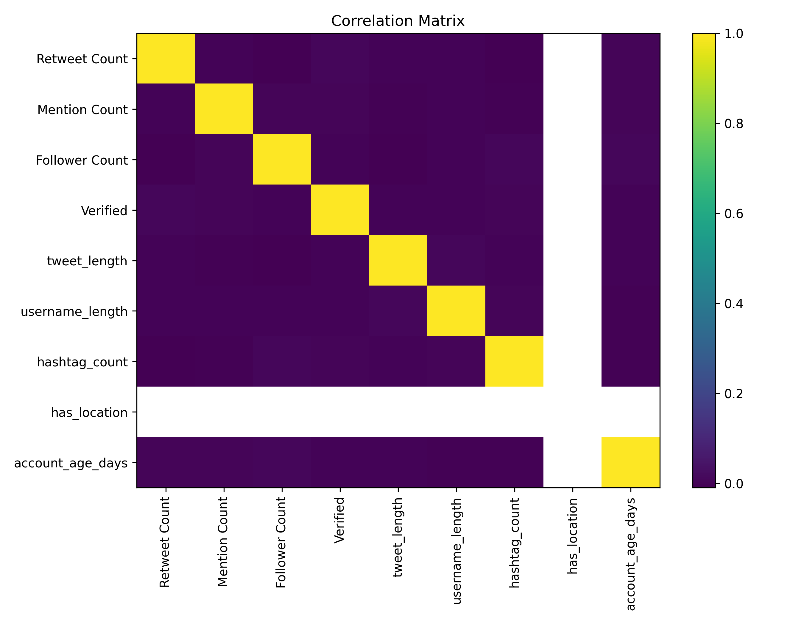
      <br/>
      <b>Feature Correlation Matrix</b>
    </td>
    <td align="center">
      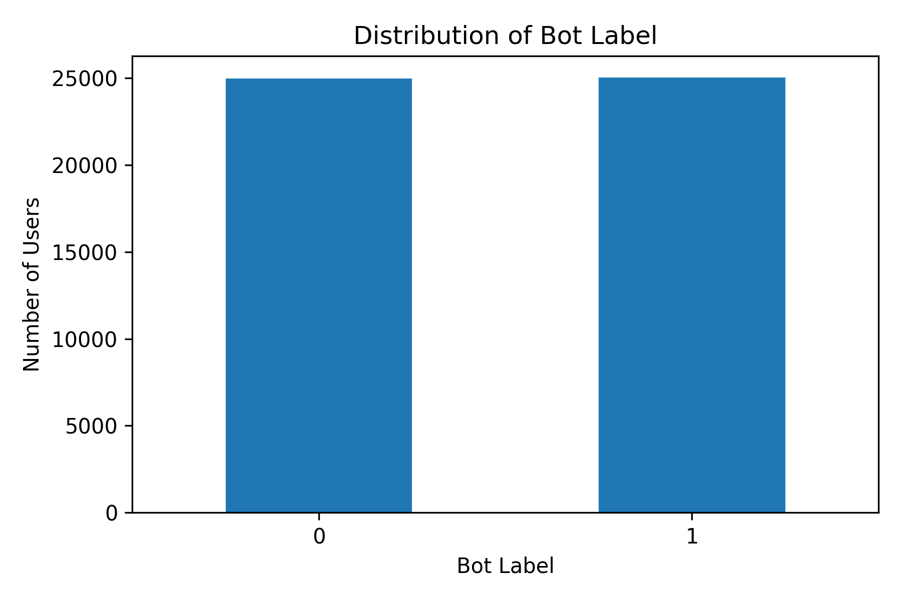
      <br/>
      <b>Bot vs Human Distribution</b>
    </td>
  </tr>
</table>

### 12.2 Model Selection

<table align="center">
  <tr>
    <td align="center">
      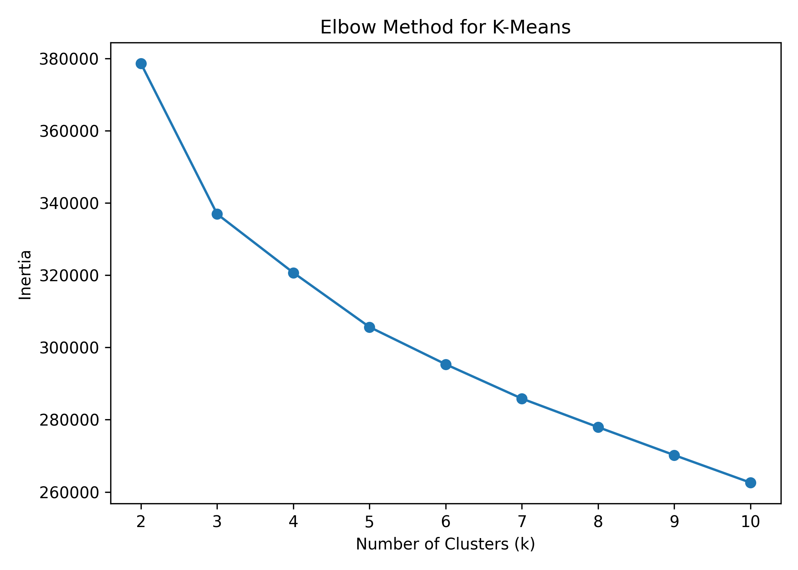
      <br/>
      <b>Elbow Method for K-Means</b>
    </td>
    <td align="center">
      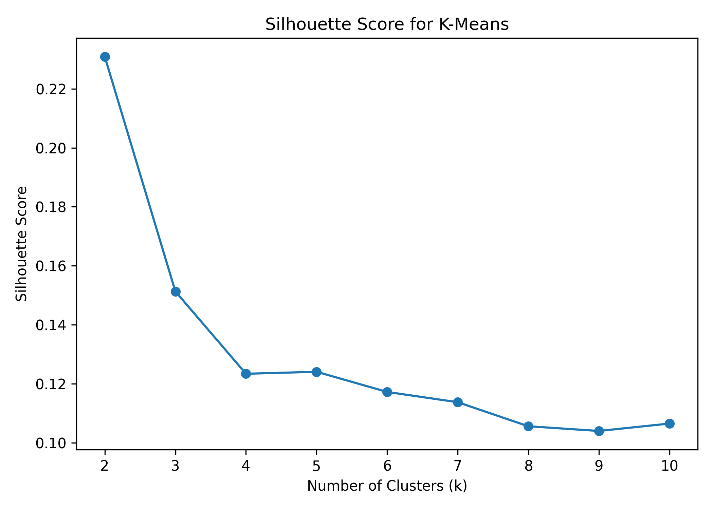
      <br/>
      <b>Silhouette Score for K-Means</b>
    </td>
  </tr>
</table>

### 12.3 Clustering and Anomaly Visualization

<table align="center">
  <tr>
    <td align="center">
      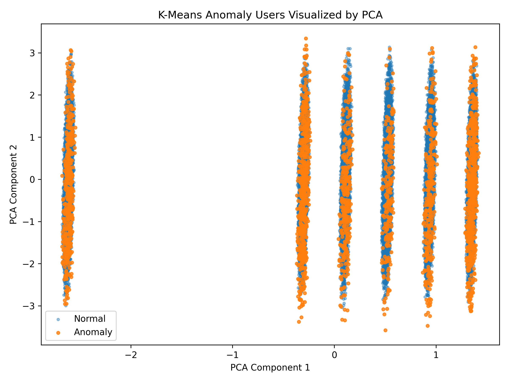
      <br/>
      <b>K-Means Anomaly Detection using PCA</b>
    </td>
    <td align="center">
      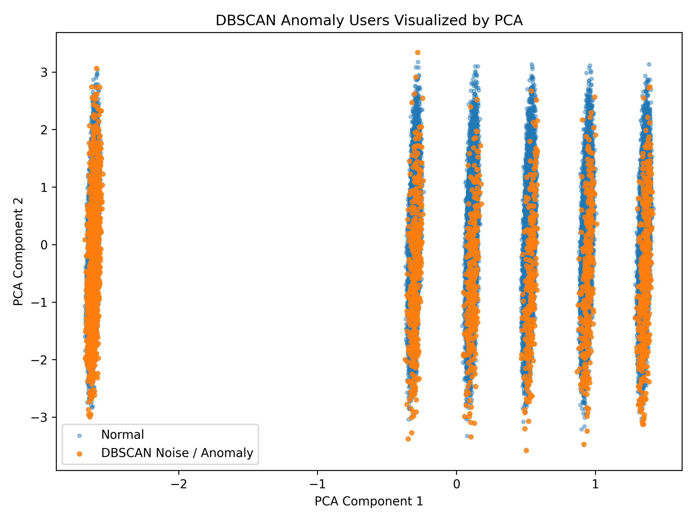
      <br/>
      <b>DBSCAN Anomaly Detection using PCA</b>
    </td>
  </tr>
</table>

### 12.4 Algorithm Comparison

<table align="center">
  <tr>
    <td align="center">
      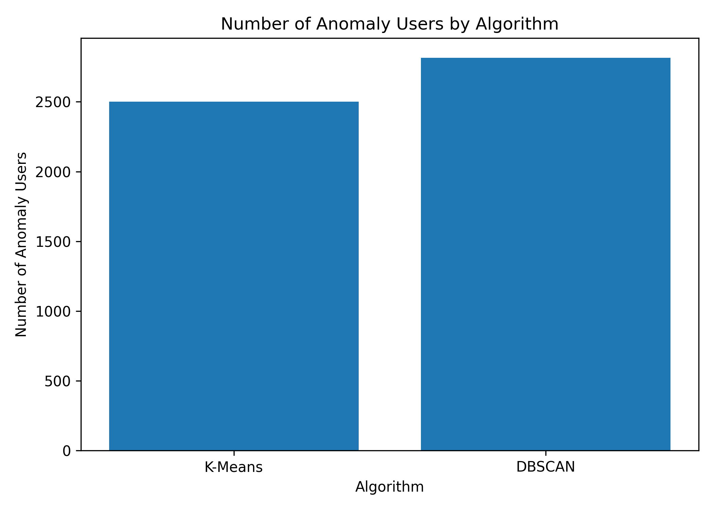
      <br/>
      <b>Number of Anomaly Users</b>
    </td>
    <td align="center">
      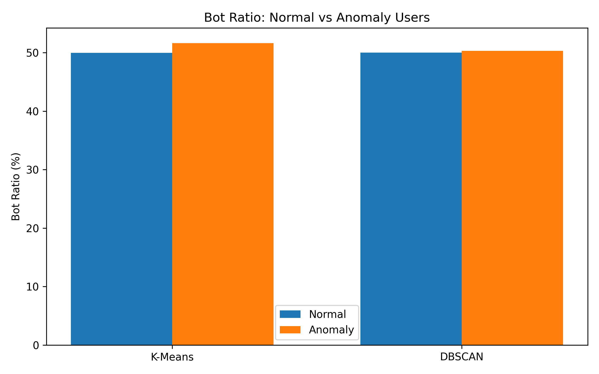
      <br/>
      <b>Bot Ratio: Normal vs Anomaly</b>
    </td>
  </tr>
  <tr>
    <td align="center" colspan="2">
      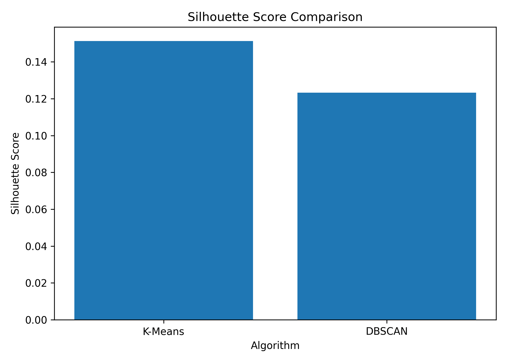
      <br/>
      <b>Silhouette Score Comparison</b>
    </td>
  </tr>
</table>

---

## 13. Limitations

Although the project successfully applies clustering methods to detect abnormal users, there are several limitations:

* The selected features are relatively simple and may not fully capture complex bot behavior.
* Tweet content is represented only by `tweet_length`, not by semantic text embeddings.
* The model does not use network-based features such as follower/following graph structure.
* Since clustering does not learn from `bot_label`, anomaly users may not perfectly match bot accounts.
* PCA visualizations are only used for 2D interpretation and do not represent the full high-dimensional feature space.
* DBSCAN is sensitive to the choice of `eps` and `min_samples`.

---

## 14. How to Run

### 14.1 Clone the Repository

```bash
git clone https://github.com/TanDoan1234/social-anomaly-clustering.git
cd social-anomaly-clustering
```

### 14.2 Install Dependencies

```bash
pip install -r requirements.txt
```

### 14.3 Prepare Dataset

Place the dataset file at:

```text
datasets/raw/bot_detection_data.csv
```

### 14.4 Run Notebooks

Open Jupyter Notebook or JupyterLab and run the notebooks in order:

```text
01_explore_dataset.ipynb
02_preprocessing_feature_engineering.ipynb
03_kmeans_clustering.ipynb
04_dbscan_clustering.ipynb
05_evaluation_visualization.ipynb
```

### 14.5 Expected Outputs

After running all notebooks, the following outputs should be generated:

```text
datasets/cleaned/bot_detection_clean.csv
datasets/processed/user_features.csv
datasets/processed/user_features_scaled.csv
datasets/processed/user_features_with_label.csv

results/csv/kmeans_clustered_users.csv
results/csv/kmeans_anomaly_users.csv
results/csv/dbscan_clustered_users.csv
results/csv/dbscan_anomaly_users.csv
results/csv/evaluation_summary.csv

results/models/scaler.pkl
results/models/kmeans_model.pkl
results/models/dbscan_model.pkl

results/figures/elbow_method.png
results/figures/silhouette_score.png
results/figures/pca_kmeans_anomaly.png
results/figures/pca_dbscan_anomaly.png
results/figures/compare_anomaly_users.png
results/figures/compare_bot_ratio_normal_vs_anomaly.png
results/figures/compare_silhouette_score.png
```

---

## 15. Conclusion

This project demonstrates how unsupervised clustering techniques can be applied to detect anomalous user behavior on social media.

K-Means and DBSCAN were both able to identify a small group of users whose behavior differs from the majority. K-Means detected 2,500 anomaly users, while DBSCAN detected 2,816 anomaly users.

K-Means achieved a higher Silhouette Score and produced anomaly users with a slightly higher bot ratio compared to DBSCAN. However, both methods showed that the current feature set is not strong enough to clearly distinguish bot accounts from human accounts.

The project successfully demonstrates a full data mining workflow:

```text
Data exploration
-> Data preprocessing
-> Feature engineering
-> Feature scaling
-> Clustering
-> Anomaly detection
-> Evaluation
-> Visualization
```

Overall, this work is suitable as a data mining final project and can serve as a foundation for more advanced social media anomaly detection systems.

---